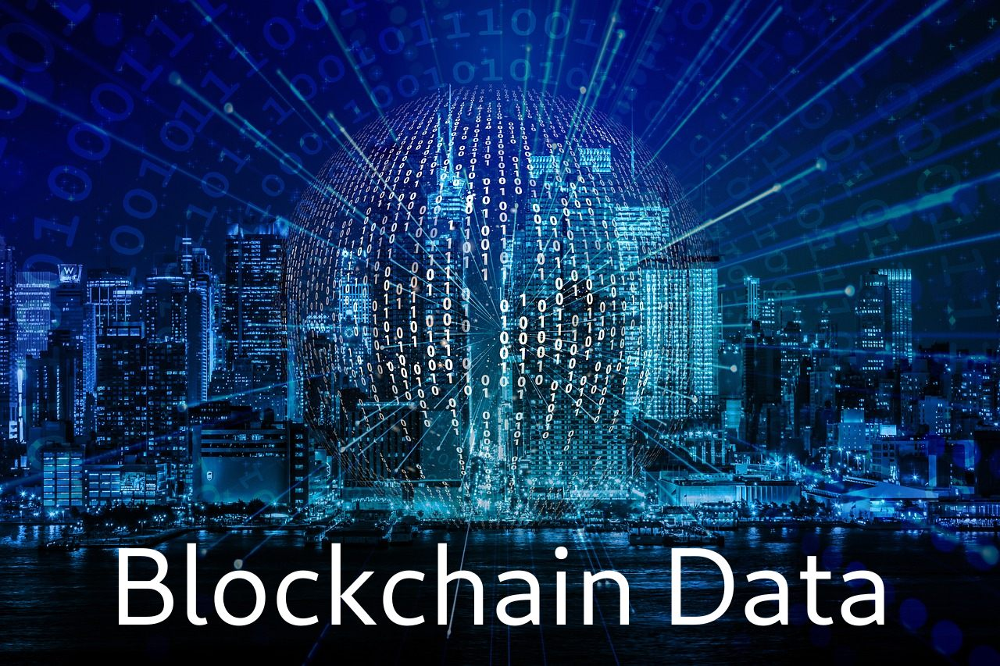

# R-Tutorials-Blockchain-Data

This series of posts showcases how easy it is to begin working with Blockchain Data and obtain Real Datasets which can be used instead of the common "test" datasets that are frequently referenced or used in POCs and demos by Data Scientists.

The Series uses the R programming language to obtain data and provides some simple motivating examples of it. It will conclude with a basic working Shiny Web App that can be deployed locally or to shinapps.io
